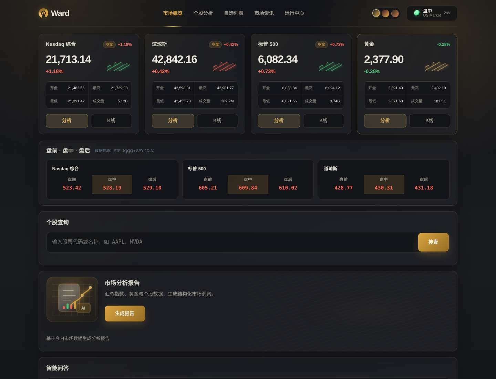
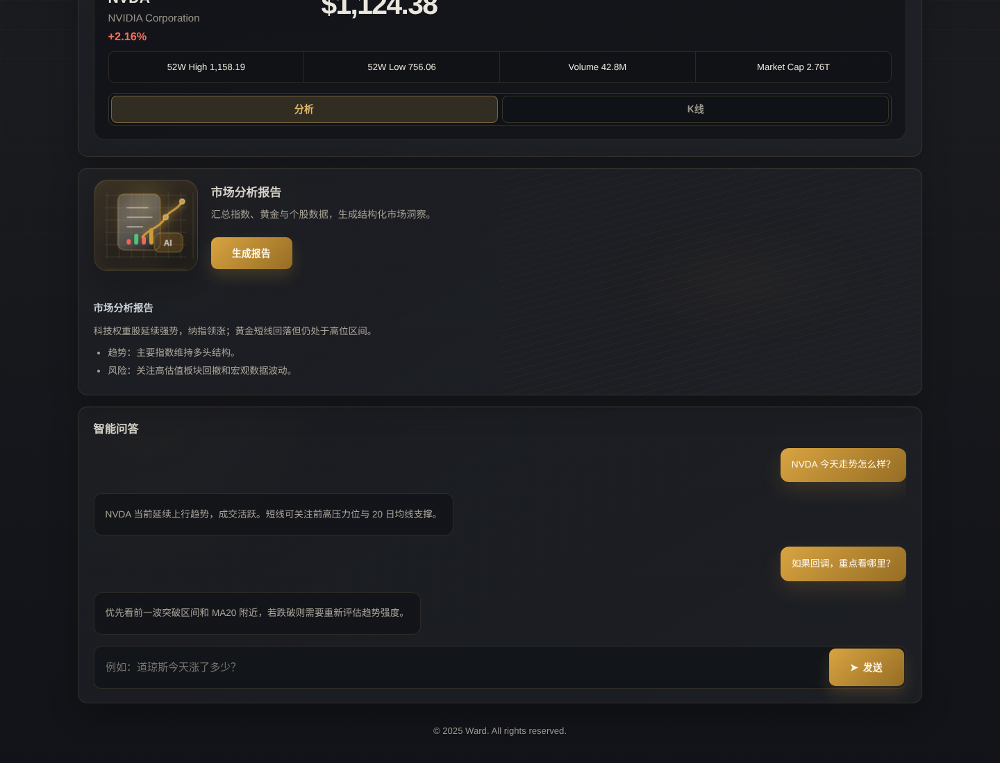
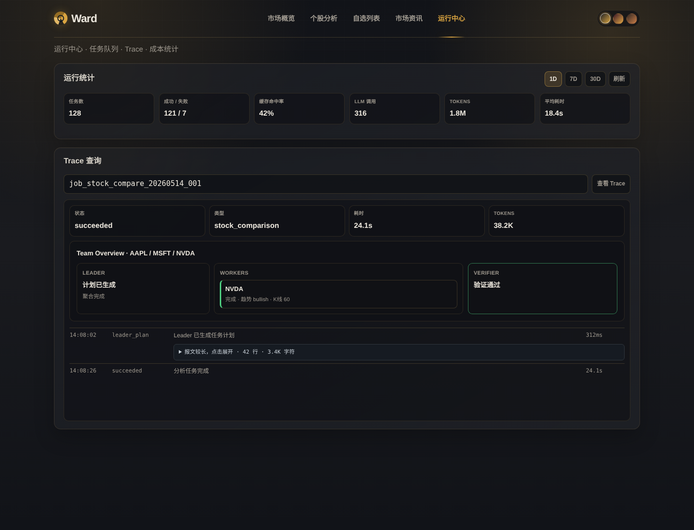

# Ward — 美股市场数据分析

基于 AI 的美股市场数据分析工具，支持指数实时行情、盘前/盘中/盘后行情、个股查询、K 线技术图表、指数 AI 分析、个股 AI 分析报告、AI 智能问答。

> ⚠️ **投资风险提示**：本工具所有数据仅供参考，不构成任何投资建议。入市有风险，投资需谨慎。


---

## 功能特性

### 已实现

#### 📊 指数行情
- 默认展示 Nasdaq 综合、道琼斯、标普 500 三大指数
- 交易时段内每 30 秒自动刷新
- 收盘状态自动检测
- 点击展开详细行情（开盘价、最高、最低、成交量）

#### 🕐 盘前 / 盘中 / 盘后行情
- 展示三大指数盘前（Pre-Market）、盘中（Regular）、盘后（After-Hours）三个时段价格
- 数据来源：QQQ（纳指）、SPY（标普）、DIA（道指）ETF
- 跟随主行情刷新周期自动更新

#### 📈 K 线图与技术指标
- 支持指数和个股 K 线（历史数据）
- 均线叠加：MA5 / MA20 / MA60
- 支撑位 / 压力位自动标记
- 黄金分割线
- 全屏 overlay 展示

#### 🔍 个股查询
- 输入股票代码或名称搜索
- 实时行情：现价、涨跌幅、52 周高低、成交量、市值、PE
- 点击卡片刷新单票行情

#### 🤖 指数 AI 分析
- 每个指数卡片独立提供「🧠 AI 分析」按钮
- Nasdaq 综合、道琼斯、标普 500 均可单独分析
- 基于 60 日 K 线原始数据（OHLCV）进行 AI 技术分析
- 指数 AI 分析结果会带入智能问答上下文

#### 📝 个股 AI 分析报告
- 每个个股卡片提供「🧠 AI 分析」按钮
- 一键生成单票深度 AI 分析报告
- 包含技术面分析、支撑/压力位、市场情绪研判
- Markdown 格式渲染，表格、加粗、列表均可

#### 💬 智能问答
- 自然语言提问，AI 基于实时市场数据回答
- 对话历史本地 SQLite 持久化
- 支持加载更多历史消息（游标分页）
- 流式输出，实时显示 AI 回复
- 指数 AI 分析报告自动带入问答上下文

---

## 界面预览

> 以下截图使用演示数据生成，用于展示界面布局。

### 市场概览



### 个股分析、市场报告与智能问答



### 运行中心与 Trace 查询



---

## 快速开始

### 环境要求

- Python 3.12+
- [uv](https://github.com/astral-sh/uv)（推荐）或 pip

### 1. 克隆代码

```bash
git clone git@github.com:rainj2013/ward-agent.git
cd ward-agent
```

### 2. 配置 API 密钥

```bash
cp .env.example .env
```

编辑 `.env`，填入 Anthropic 兼容接口地址和 API Key：

```env
ANTHROPIC_AUTH_TOKEN=***
ANTHROPIC_BASE_URL=https://api.deepseek.com/anthropic
```

也可以启动 Ward 后打开 `http://localhost:8000/settings`，在本机设置页保存 BASE API 和 API Key。设置写入被 Git 忽略的 `.env`，重启 Ward 后生效。

Ward 从项目根目录的 `.env` 加载配置。API Key 按 `ANTHROPIC_AUTH_TOKEN`、`DEEPSEEK_API_KEY`、`API_KEY`、`MINIMAX_API_KEY`、`MINIMAX_PORTAL_API_KEY` 的顺序取第一个非空值，BASE API 按 `ANTHROPIC_BASE_URL`、`DEEPSEEK_API_URL`、`URL` 的顺序取值。模型使用 `LLM_MODEL`，默认 `deepseek-v4-flash`。

### 3. 安装依赖并运行

```bash
uv sync
uv run python run.py
```

### 4. 访问

浏览器打开 http://localhost:8000

---

## 与 AI Agent 集成

Ward 提供 REST API，可以接入任何 AI Agent（Hermes、OpenClaw、Claude Code 等），在微信/飞书/Telegram 等平台通过对话调用 Ward 数据。

### ward-skill

[ward-skill](https://github.com/rainj2013/ward-skill) 是 Ward 的 Agent 技能包，让 AI Agent 知道如何调用 Ward API。

支持平台：

| Agent | 安装方式 |
|--------|---------|
| Hermes | `cp -r ward ~/.hermes/skills/ && hermes gateway run --replace` |
| OpenClaw | `cp -r ward ~/.openclaw/skills/` |
| Claude Code / 其他 | 直接读取 `SKILL.md` 获知 API 调用方式 |

安装后，在微信/飞书等平台直接发消息问美股即可，Agent 自动调 Ward API 回复。

详细说明见 [ward-skill](https://github.com/rainj2013/ward-skill)。

---

## 技术架构

```
ward-agent/
├── src/ward/
│   ├── api/                   # 按市场、股票、任务、设置和聊天拆分的路由
│   ├── core/
│   │   ├── config.py          # .env 配置管理
│   │   ├── llm.py             # 统一 LLM 客户端和调用协议
│   │   └── data_fetcher.py    # 数据抓取（akshare + yfinance）
│   ├── schemas/models.py      # Pydantic 模型
│   ├── services/
│   │   ├── history_service.py # 聊天历史查询
│   │   ├── nasdaq_service.py  # 市场概览
│   │   ├── index_service.py   # 指数行情 + AI 分析
│   │   ├── stock_service.py   # 个股行情
│   │   ├── report_service.py  # AI 报告生成
│   │   └── db/
│   │       ├── connection.py            # SQLite 连接策略
│   │       └── conversation_service.py  # SQLite 聊天历史
│   └── app.py                 # FastAPI 应用入口
└── static/
    ├── index.html              # 前端页面
    ├── css/                    # 通用及页面样式
    └── js/                     # 主页面、Runtime、设置与安全渲染脚本
```

- **后端**：FastAPI + SQLite
- **前端**：原生 HTML/CSS/JS（无框架依赖）
- **数据源**：akshare + yfinance
- **AI**：Anthropic 兼容 API（Base URL、Key 和模型可配置）

---

## 功能路线图

### Phase 1 — 基础展示层 ✅
- [x] 默认展示 Nasdaq + 道指 + 标普500 三个指数
- [x] 增加黄金行情监控，并在市场总览中统一展示
- [x] 交易时间段内定时自动刷新（每 30 秒）
- [x] 指数卡片支持点击展开更多数据

### Phase 2 — 交互式问答 ✅
- [x] 聊天输入框（类似 ChatGPT 那种对话 UI）
- [x] AI 基于实时市场数据回答用户问题
- [x] 对话历史展示
- [x] 指数 AI 分析报告自动带入问答上下文
- [x] 页面已加载数据结构化注入 System Prompt，优先复用上下文，缺数据时再调用工具
- [x] 工具调用、thinking、取消状态通过 SSE 渐进展示
- [x] 用户消息右侧、AI 回复左侧，按常见聊天工具布局

### Phase 3 — 个股深度分析 ✅
- [x] 输入股票代码/名称
- [x] 自动抓取：股价、PE、财务数据、近期新闻
- [x] AI 生成个股分析报告
- [x] 支持任意美股代码规范化，不再局限于硬编码股票池
- [x] 个股分析任务异步化，后台排队执行并回填结果

### Phase 4 — 指数 AI 分析 ✅
- [x] 每个指数独立 AI 分析按钮（Nasdaq / 道琼斯 / 标普500 / 黄金）
- [x] 基于 60 日 K 线原始数据进行分析
- [x] 分析结果缓存，支持单独刷新
- [x] 黄金使用独立分析 prompt，覆盖美元、通胀、避险情绪等贵金属维度

### Phase 5 — 技术分析图表 ✅
- [x] K 线图（支持历史数据）
- [x] 均线叠加（MA5/MA20/MA60）
- [x] 支撑位/压力位标记
- [x] 黄金分割线
- [x] 图表从模态框升级为全宽 overlay，降低小屏遮挡

### Phase 6 — Agent Harness 与执行约束 ✅
- [x] 从手写 agent loop 迁移到 Mini-Agent 框架
- [x] 工具 description 明确区分个股 / 指数适用边界，减少误调用
- [x] 设置 `max_steps=20` 和 `token_limit=80000`，避免 Agent 无限制运行
- [x] 支持安全取消，在自然断点停止并清理不完整消息
- [x] 工具错误结构化返回给 AI，支持二次判断或向用户解释失败原因

### Phase 7 — 外部 Tool Calling ✅
- [x] AkShare / yfinance 接口标准化
- [x] 封装 LLM 可调用的工具：get_stock_quote、get_stock_kline、get_stock_analyze、get_index_kline、get_index_analyze、get_market_overview、search_stock
- [x] 智能问答支持主动获取页面之外的信息（新闻、财报日历等）
- [x] ward-skill 支持 Hermes、OpenClaw、Claude Code 等外部 Agent 通过 REST API 调用 Ward 数据

### Phase 8 — 智能上下文管理 ✅
- [x] 基于本地估算和 API 返回 token 用量触发消息历史压缩
- [x] Token 超限后自动摘要：保留用户意图，压缩 Agent 执行过程
- [x] ChatContext 携带页面已加载数据注入 System Prompt，减少 Tool Call 开销

### Phase 9 — 低速率模型 Runtime ✅
- [x] AI 分析统一任务化：`queued -> running -> succeeded / failed`
- [x] SQLite 持久化 Job 与事件，服务重启时终止未完成任务
- [x] 低并发内存队列保护慢速 / 低速率大模型 API
- [x] 个股、指数、市场报告、多股对比支持缓存复用，cache key 纳入模型名
- [x] 分析过程通过 SSE 输出排队、缓存检查、数据获取、LLM 调用、验证等阶段状态

### Phase 10 — Runtime 可观测性 ✅
- [x] 独立运行中心页面：任务统计、Trace 查询、成本 / token 统计
- [x] 每个 AI 分析结果附带 `job_id` 和「查看 Trace」入口
- [x] Trace 记录 prompt、模型原始返回、耗时、token、缓存命中等信息
- [x] 长 Trace 报文默认折叠，减少运行中心滚动成本
- [x] Runtime 统计支持任务数、成功 / 失败、缓存命中率、LLM 调用、token、平均耗时

### Phase 11 — 多股对比 Team ✅
- [x] 智能问答识别多股对比意图，自动创建后台对比任务
- [x] Leader 规划对比目标，多个 Worker 独立抓取和整理单股摘要
- [x] Leader 聚合 Worker 摘要生成横向比较报告
- [x] Deterministic Verifier 检查报告章节、占位符和数据一致性
- [x] Runtime Team Overview 展示 Leader / Workers / Verifier 执行状态

### Phase 12 — 后续计划
- [ ] 引入 LLM Reviewer 做更深层事实检查与自动重写，而不仅是 deterministic verifier
- [ ] 支持复杂任务重跑、人工确认、版本管理等更完整的工作流能力
- [ ] 在真实按量计费场景下补充模型价格表和成本估算
- [ ] 为核心服务补充 pytest 测试，覆盖数据标准化、Job Runtime、SSE 事件格式和 Verifier 规则

## License

MIT License — 保留署名即可随意使用，包括商业用途。

---

## 免责声明

本工具仅供信息展示和辅助参考，所有市场数据均来源于第三方公开接口，**不构成任何投资建议**。投资有风险，入市需谨慎。本工具的开发者不对任何因使用本工具而产生的投资损失承担责任。

---

## 致谢

本项目使用以下开源数据源：

- [akshare](https://github.com/akfamily/akshare) — 东方财富、新浪财经等数据
- [yfinance](https://github.com/ranaroussi/yfinance) — Yahoo Finance 美股数据
- [ECharts](https://echarts.apache.org/) — K 线图可视化
- [Marked](https://marked.js.org/) — Markdown 渲染
